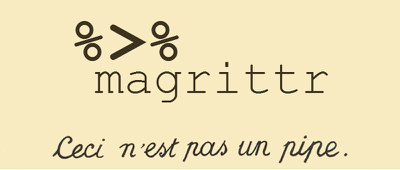

 <http://healthyr.surgicalinformatics.org>

Coding style
------------

### Our usual script preamble:

At the beginning of each script, we usually have these lines:

``` r
library(tidyverse)  # packages: ggplot2, tibble, tidyr, readr, purrr, and dplyr 
library(forcats)    # all the fct_recode() etc. functions,  forcats is an anagram for factors
library(broom)      # functions: tidy(), glance(), augment()
library(magrittr)   # includes the %<>% assignment-pipe ( %>% is loaded from dplyr)
```

To see more information about any package or function, move your cursor to it and press F1.

### The pipe operator - %&gt;%:



*(Image source: <https://cran.r-project.org/web/packages/magrittr/vignettes/magrittr.html> )*

The pipe operator ( `%>%` ) sends an R object (usually a data frame) into a function. You can type it up, or you can use the keyboard short-cut of `Control+Shift+M`. It looks a bit scary at first, but once you get used to it you won't want to do R any other way.

Let's load some example data (the `diamonds` dataset that comes with `ggplot2`):

``` r
mydata = diamonds

# or equivalently
mydata <- diamonds

# or equivalently
diamonds -> mydata
```

(We tend to use the `=` rather than `<-`, but sometimes we do use the left-to-right arrow: `->`.)

You can summarise a data frame like this:

``` r
summary(mydata)
```

Or write the same thing using a pipe:

``` r
mydata %>% summary()
```

This might not seem that useful at first as `mydata %>% summary()` is actually longer than `summary(mydata)`. Nevertheless, piping becomes very useful when doing a few manipulations after another or filtering data before summarising it.

For example, look at this line:

``` r
summary(select(filter(mydata, cut %in% c('Premium', 'Ideal')), cut, price))
```

    ##         cut            price      
    ##  Fair     :    0   Min.   :  326  
    ##  Good     :    0   1st Qu.:  929  
    ##  Very Good:    0   Median : 2178  
    ##  Premium  :13791   Mean   : 3897  
    ##  Ideal    :21551   3rd Qu.: 5364  
    ##                    Max.   :18823

(`cut %in% c('Premium', 'Ideal')` is equivalent to `cut == 'Premium' | cut == 'Ideal'`, `|` means **or**)

It is quite hard to figure out what is going on there. Writing the exact same workflow out with pipes makes it (human) readable:

``` r
mydata %>% 
  filter(cut %in% c('Premium', 'Ideal')) %>% 
  select(cut, price) %>% 
  summary()
```

    ##         cut            price      
    ##  Fair     :    0   Min.   :  326  
    ##  Good     :    0   1st Qu.:  929  
    ##  Very Good:    0   Median : 2178  
    ##  Premium  :13791   Mean   : 3897  
    ##  Ideal    :21551   3rd Qu.: 5364  
    ##                    Max.   :18823

Reading this: Take `mydata` and filter for cuts that are either "Premium" or "Ideal", select `cut` and `price`, and summarise.

`->`:
-----

Once you really get into piped workflows it starts making sense to use the left-to-right assignment arrow `->`:

``` r
mydata %>% 
  filter(cut %in% c('Premium', 'Ideal')) %>% 
  select(cut, price) ->
  mydata_highquality
```

is equivalent to:

``` r
mydata_highquality = mydata %>% 
  filter(cut %in% c('Premium', 'Ideal')) %>% 
  select(cut, price)
```

`%<>%`:
-------

And finally, there is `%<>%` to send data into a function, and then save the result back into the original variable: it is a combination of `%>%` and `<-`. We don't normally use it when filtering or selecting variables from the original data frame (as you will overwrite and loose everything else), but it is very useful when doing a minor manipulation on a single column.

For example, even after filtering out the Fair, Good, and Very Good diamond cuts, they still show up with 0 counts in `summary()` above. This is because R knows that `cut` is a factor rather than just a character column:

``` r
mydata$cut %>% class()
```

    ## [1] "ordered" "factor"

If you want to get rid of the sub-par categories completely, you need to use `fct_drop` from `library(forcats)` (note the use of `%<>%`):

``` r
mydata_highquality$cut %<>% fct_drop()

mydata_highquality %>% 
  summary()
```

    ##       cut            price      
    ##  Premium:13791   Min.   :  326  
    ##  Ideal  :21551   1st Qu.:  929  
    ##                  Median : 2178  
    ##                  Mean   : 3897  
    ##                  3rd Qu.: 5364  
    ##                  Max.   :18823

`""` or `''`:
-------------

In most cases, `"Ideal"` and `'Ideal'` are equivalent. `''` is one less key to press (as it doesn't require *Shift*), but `""` is more widely used by the R community.
